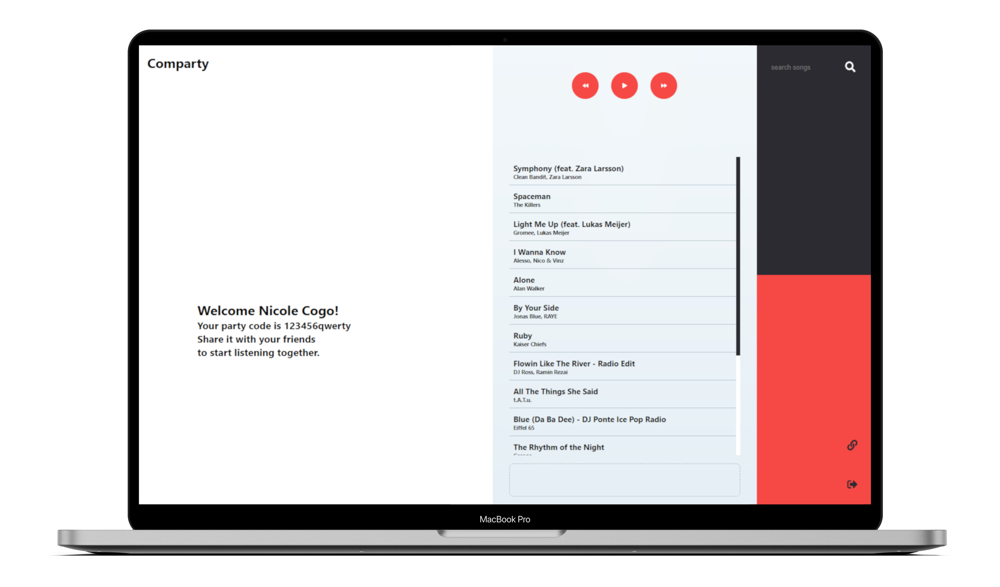
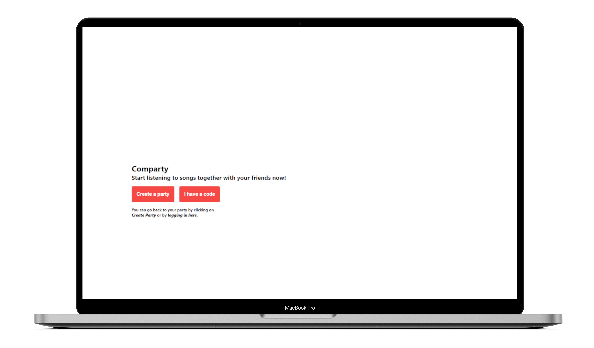

# Comparty

Comparty is an app that allows people to listen to songs together. Through the app's web player, every user can control the shared playback (playing, pausing and skipping songs), while listening on their own devices. The shared playlist can also be modified by all users.

## Screenshots
#### Homepage


#### Create/join party page


## Getting started

A few things you have to take in consideration before using Comparty.

The repository contains both Comparty's [server](https://github.com/nicolecogo/comparty/tree/master/server) and [client](https://github.com/nicolecogo/comparty/tree/master/client). You'll need to install Comparty server first, and then set up Comparty client.

### Clone the repo
```
git clone https://github.com/nicolecogo/comparty
cd comparty
```

### Setup server
1. Install dependencies
```
cd server
npm install
```
2. Setup configuration file
```
cp example.env .env
```
Comparty app is based on Spotify for accessing and playing songs. Since the server handles the authentication requests for logging into Spotify, you'll need to provide a Spotify Client ID aswell as a Client secret in the ```.env``` file.

<details><summary><b>Show instructions for getting Spotify credentials</b></summary>

1. Login to Spotify account and access your [developer's dashboard](https://developer.spotify.com/dashboard)
2. Click on <b>CREATE A CLIENT ID</b>
3. Enter Application Name and Application Description and then click <b>CREATE</b>. Your application is registered, and the app view opens.
4. Copy your <b>Client ID</b> and <b>Client Secret</b> and paste them to the ```.env``` file.
5. On the app view, click <b>Edit Settings</b> to update your <b>Redirect URIs</b>. Here you'll want to add the following URIs (unless you changed them in the ```.env``` file)
```
http://localhost/3001
http://localhost/3001/login
http://localhost/3001/login/callback
```

</details>

3. And you are set with the server! You can now run it with ```npm run```

### Setup client
1. Install dependencies
```
cd client
npm install
```

2. Setup configuration file. For the client you'll need to provide a Spotify collaborative playlist id in the ```.env``` file.
```
cp example.env .env
```

3. You are set with the client and good to go! Just run ```npm run``` and a browser should open with the app. Since the idea here is to synchronize playbacks between at least two clients, just copy the URI in another browser and have fun!

<b>Important note:</b> A Spotify Premium account is required in order to use the app's features.


## Built with

<b>Front-end</b>
* [React](https://reactjs.org/)

<b>Back-end</b>
* [Node.js](https://nodejs.org/en/)
* [Express](https://expressjs.com/)
* [Socket.io](https://socket.io/)

<b>Services</b>
* [Spotify Web API](https://developer.spotify.com/documentation/web-api/)
* [Spotify Web Playback SDK](https://developer.spotify.com/documentation/web-playback-sdk/)


## Observations
It is a work in progress, there is still a lot of room for improvement and features that would be awesome to have.

#### Room for improvement
* It is not the ideal to have to provide the playlist id in the environment file, so the first thing necessary to implement is an endpoint for creating a default Comparty playlist.
* In order to make it work for multiple clients through a party code, we need to implement a Database to store playlist and party code information for each user.
* The Spotify token provided through OAuth authentication have an expiration time, so it would be more effective to require a new token automatically from the client in order to keep the session alive.
* The app handles many asynchronous states due to its nature (having event listeners from the Web Playback SDK aswell as the Sockets'). It would be optimal to have those handled by Redux, adding more consistency accross app's features.
* Socket.io makes it very easy to communicate between many clients, so it would be wise to make good use of its functionalities and create namespaces for each party.

#### Future features
* For making it more interactive and personal we need to allow users to chat, through a *web chat* and *video/audio calls*.
* Having a web player means providing all its expected commands, so let's add all of the missing player options: seek position, shuffle, repeat (synced) and volume (individually).